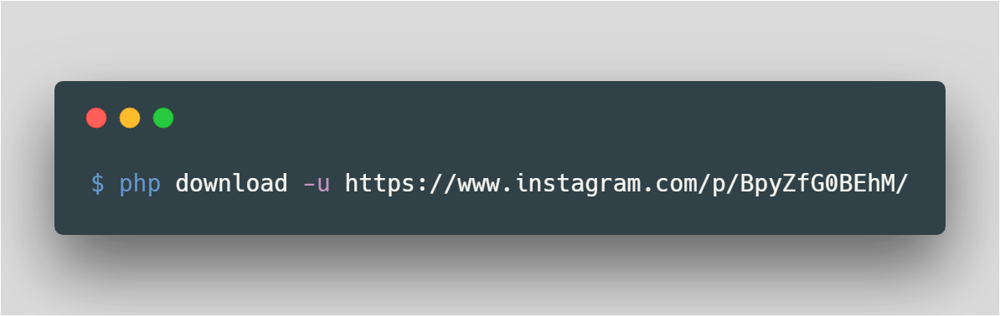

## IGDL
Instagram Download Media in PHP CLI
#### Usage

``` bash
Usage:
	download [options]

Options:
  -u, --url[=URL]             Instagram Post Url
  -h, --help                  Display this help message
  -q, --quiet                 Do not output any message
  -V, --version               Display this application version
```

#### Example


#### Downloads
All results will be downloaded to the downloads folder at the root folder of this project.